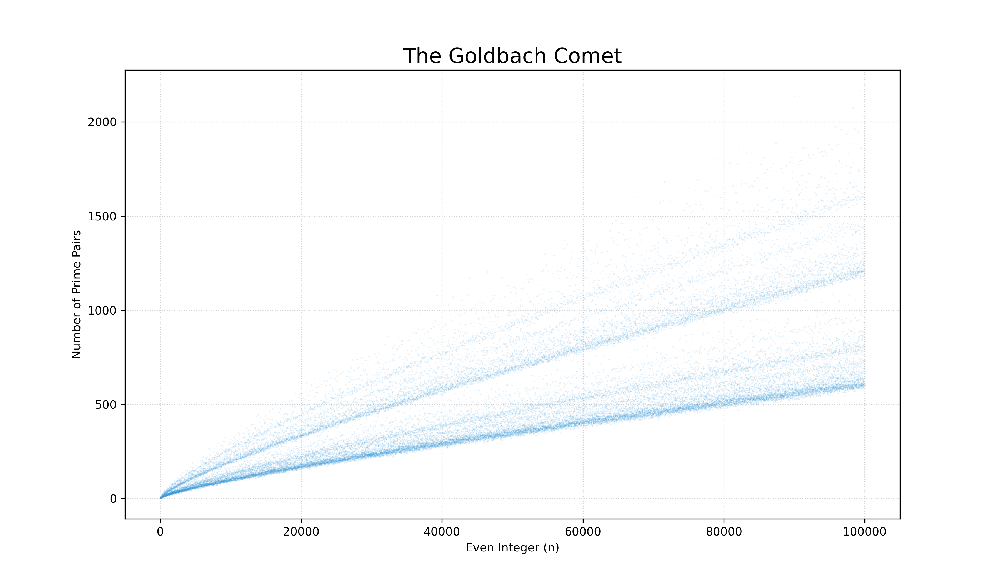

# ☄️ Goldbach Comet Scanner

A high-performance Python tool for verifying the **Goldbach Conjecture** and visualizing the results through the "Goldbach Comet."

## 🧠 The Math
The **Goldbach Conjecture** is one of the oldest unsolved problems in math. It states that every even integer greater than 2 is the sum of two prime numbers. This tool calculates how many ways each number can be split into prime pairs.

## 🚀 Features
- **High Performance:** Uses **NumPy** vectorization for speed.
- **Visuals:** Generates high-resolution scatter plots.
- **Scalable:** Successfully scanned up to **1,000,000** numbers.

## 📊 Visualization

## 🛠️ Setup
1. Install dependencies: `pip install numpy pandas matplotlib tqdm`
2. Run the scanner: `python main.py`
3. Generate the plot: `python plot_comet.py`
## 🛠️ Setup
1. Clone the repo: `git clone https://github.com`
2. Install all dependencies: `pip install -r requirements.txt`
3. Run the scanner: `python main.py`
